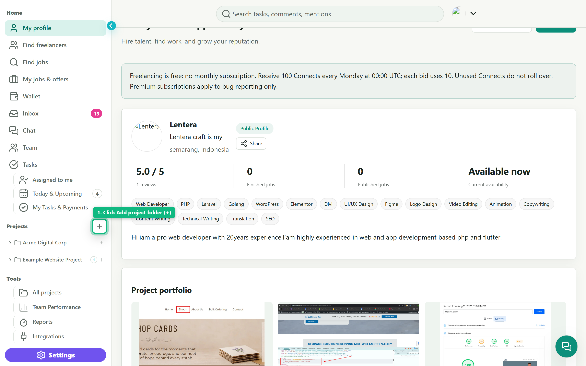
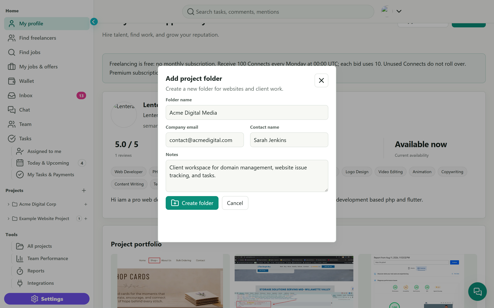
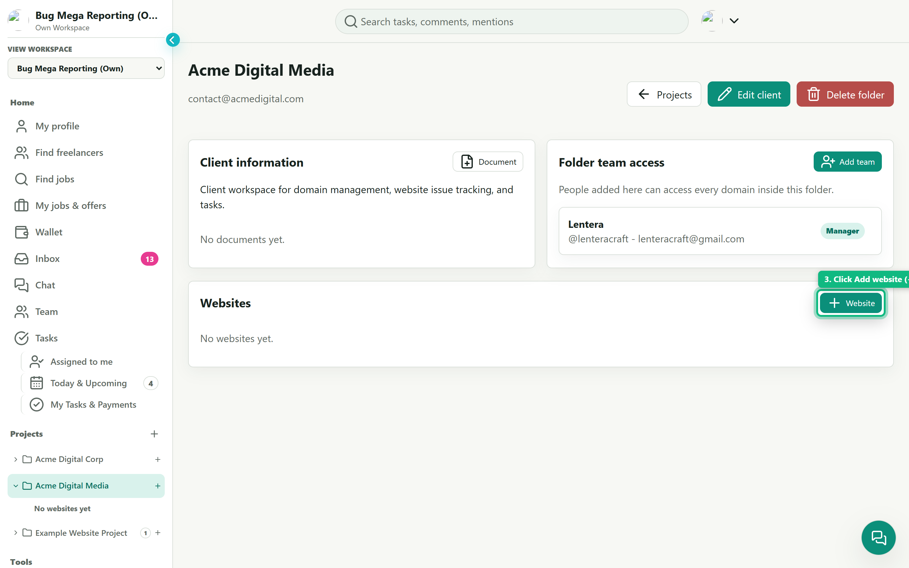
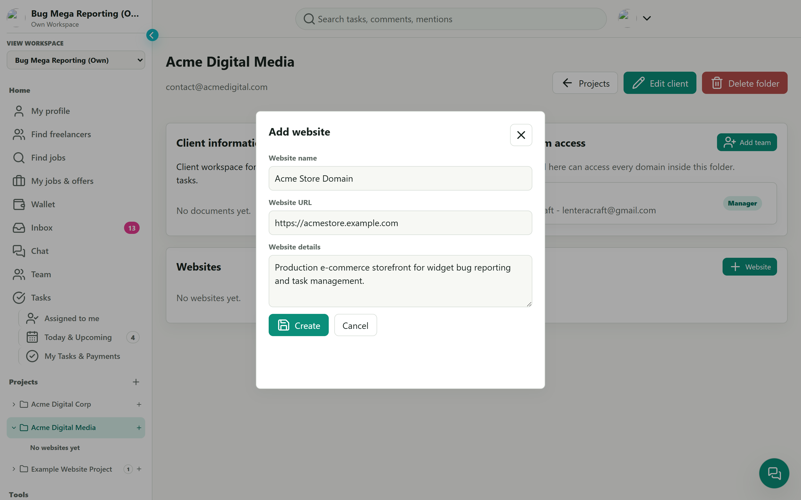
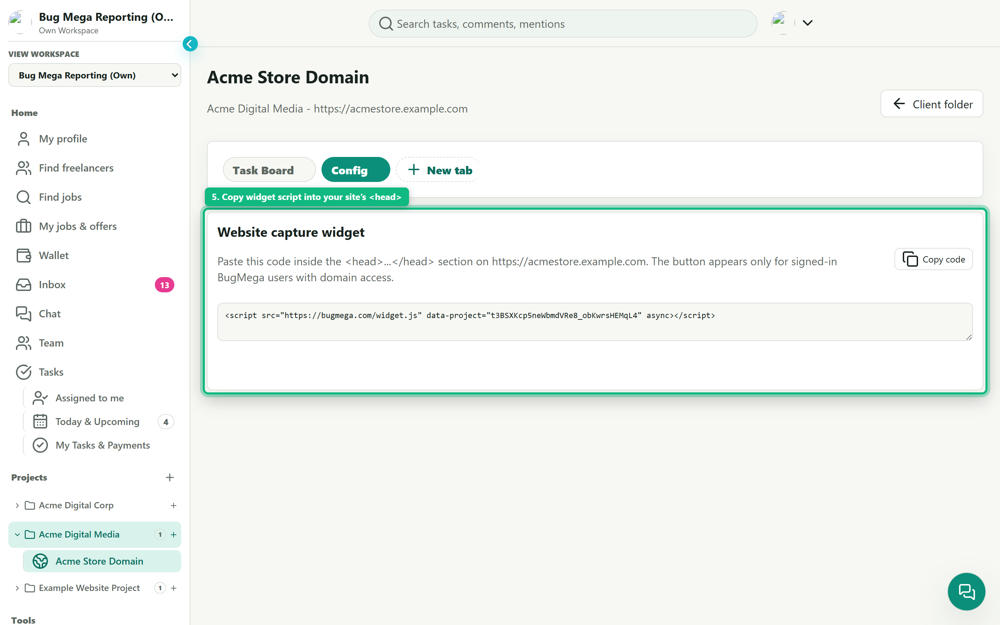
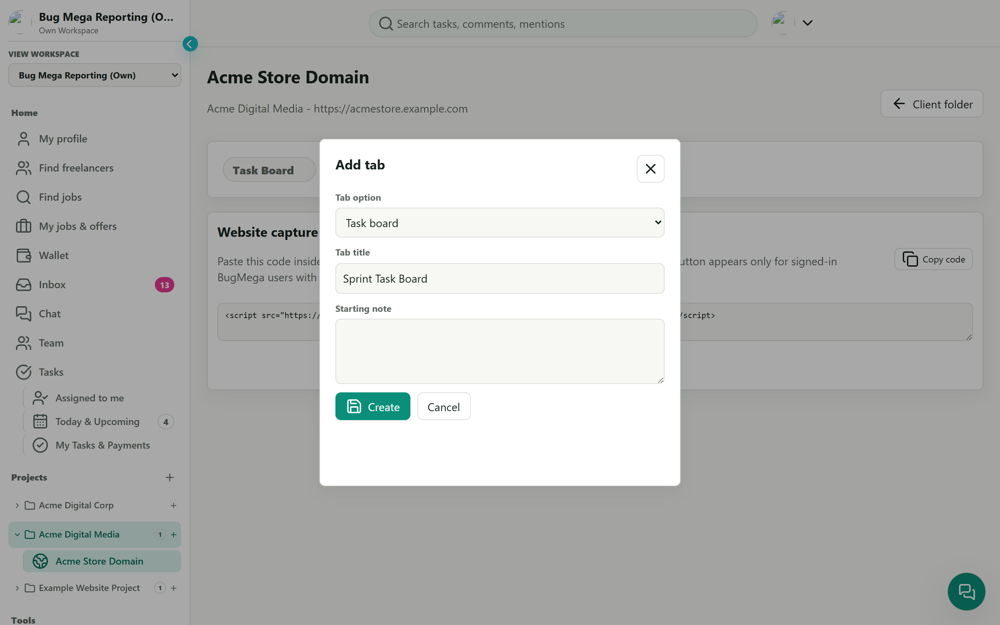
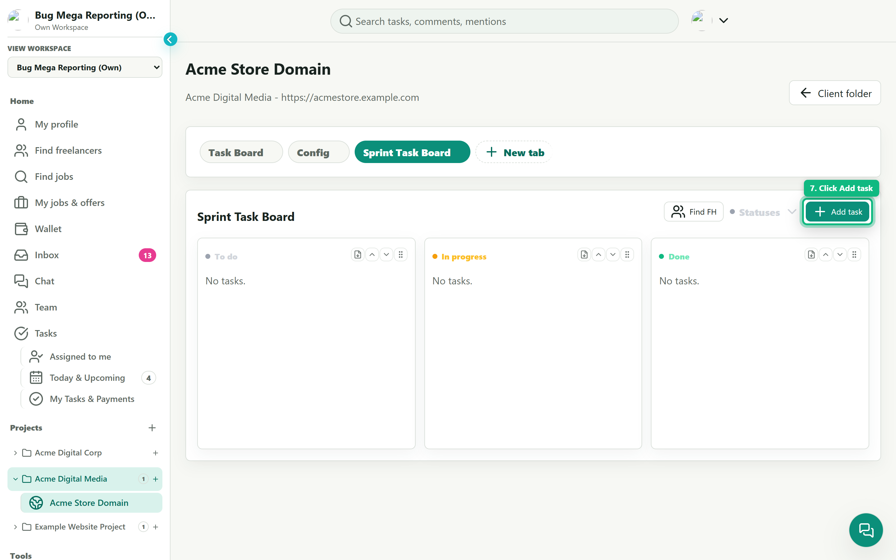
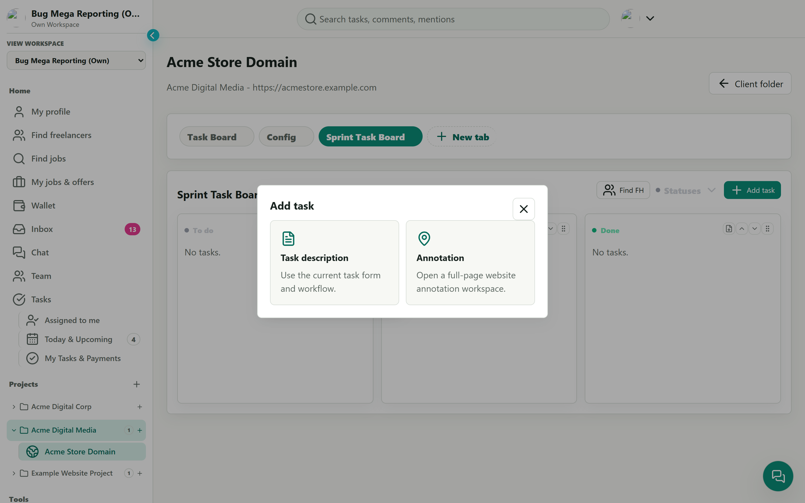
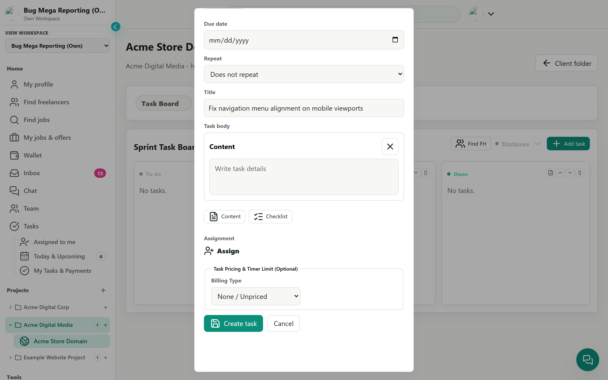

# BugMega User Guide: Setting Up Projects, Domains & Task Boards

This step-by-step visual guide walks you through setting up a project workspace from scratch in **BugMega**, connecting your website domain, embedding the live bug capture widget, and configuring a task board for issue tracking.

---

## Quick Overview of the Workflow

```
1. Add Project Folder ➔ 2. Enter Folder Details ➔ 3. Add Website ➔ 4. Enter Domain & URL
                                                                           │
   7. Create Tasks ◄─── 6. Add Task Board Tab ◄─── 5. Install Widget Script ┘
```

---

## Step 1: Click "Add project folder"

In the left sidebar under the **Projects** section, click the **`+`** (**Add project folder**) icon button next to the "Projects" heading.



> **Tip:** You can organize multiple websites, clients, and domains under distinct project folders to keep client workspaces separated and secure.

---

## Step 2: Enter Folder Details and Click "Create folder"

The **Add project folder** modal will appear. Fill in your project information:

- **Folder name:** Enter your client or project name (e.g., `Acme Digital Media`).
- **Company email:** (Optional) Contact email for notifications and billing.
- **Contact name:** (Optional) Primary stakeholder or client representative.
- **Notes:** (Optional) Brief description of the project workspace.

Click the green **Create folder** button to initialize the project folder.



---

## Step 3: Click "Add website"

After creating the folder, you will be directed to the project overview page. Under the **Websites** section, click the **`+ Website`** button (or the `+` icon beside the folder in your sidebar).



---

## Step 4: Enter Domain Name and URL

In the **Add website** dialog, configure your website domain:

- **Website name:** Friendly display name for the site (e.g., `Acme Store Domain`).
- **Website URL:** The production or staging URL (e.g., `https://acmestore.example.com`).
- **Website details:** Scope, environment details, or notes for collaborators.

Click **Create** to save and open your website dashboard.



---

## Step 5: Copy the Website Capture Widget Script into the Site's `<head>`

Once your website is created, open the **Config** tab on the website dashboard to view the **Website capture widget** section:

1. Click the **Copy code** button to copy your unique snippet.
2. Open your website's template or code editor.
3. Paste the `<script>` tag inside the `<head>...</head>` section of your website.

```html
<!-- BugMega Website Capture Widget -->
<script src="https://bugmega.com/widget.js" data-project="YOUR_PROJECT_KEY" async></script>
```



> **Security Note:** The capture widget button appears **only** for signed-in BugMega team members who have permission to access this domain. Public visitors cannot see or trigger the reporting widget.

---

## Step 6: Click "New tab" and Choose "Task board"

To track issues, bugs, and backlog items for this domain:

1. Click the **`+ New tab`** button in the website tab navigation bar.
2. In the **Tab option** dropdown, select **Task board**.
3. Enter a **Tab title** (e.g., `Sprint Task Board` or `Bugs & QA`).
4. Click **Create**.



---

## Step 7: Click "Add task" to Start Creating Tasks

Your Kanban board is now ready with workflow columns (`To do`, `In progress`, `Done`).

1. In the upper right of your task board, click **`+ Add task`**.
2. Choose your task creation method:
   - **Task description:** Standard task form with rich text description, due dates, checklists, and assignments.
   - **Annotation:** Interactive full-page website annotation workspace to pinpoint visual bugs directly on your live site.



### Task Creation Modes

When clicking **`+ Add task`**, choose between a standard ticket or visual website annotation:



### Completing the Task Form

Enter the task title, description, assignment, due date, and pricing/timer limits if applicable, then click **Create task**:



---

## Summary Checklist

| Step | Action | Key Elements |
|---|---|---|
| **1** | Click `Add project folder` | Sidebar `+` button beside **Projects** |
| **2** | Enter folder details & click `Create folder` | Folder name, email, contact, notes |
| **3** | Click `Add website` | `+ Website` button in folder overview |
| **4** | Enter domain name & URL | Domain title, URL, details |
| **5** | Copy widget script into `<head>` | **Config** tab ➔ `Copy code` ➔ paste in site's `<head>` |
| **6** | Click `New tab` & choose `Task board` | Select **Task board** option, give title |
| **7** | Click `Add task` | Create tasks via description form or live visual annotation |
